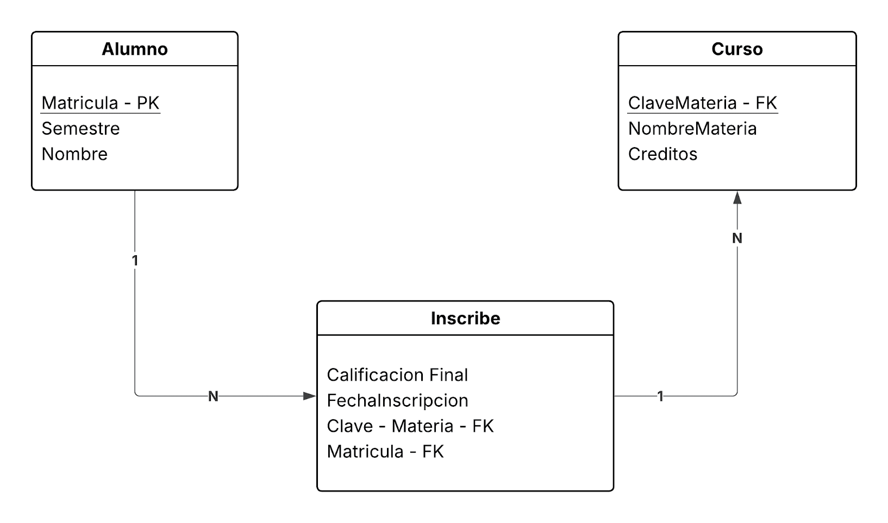

# Diccionario de datos de la base de datos control escolar 

1. Información General

| Elemento | Valor |
| :--- | :--- |
| Proyecto  | Sistema de Control Escolar |
| Descripción | Base de datos para el control escolar |
| Versión | 1.0 |
| Fecha | Junio 2026 |
| Responsable | Ing. Irving Yael Rojas Hurbano, MTI |
| SGBD | SQLServer |

2. Descripción del sistema de base de datos

El sistema administra:

- Carreras
- Alumnos
- Profesores
- Materias
- Grupos
- Inscripciones

Permite controlar la oferta educativa y la inscripción de los estudiantes

3. Catálogo de Resntrincciones Utilizadas

| Codigo | Significado |
| :--- | :--- |
| PK | Primary Key |
| FK | Foreign Key |
| NN | Not Null |
| UQ | Unique |
| AI | Auto Increment |
| CK | Check |
| DF | Default |
| FK | Foreign Key |

4. Diccionario de Datos

Tabla: Carrera

**Descripción:** _Almacena las carreras ofertadas por la universidad_

| Campo | Tipo | Longitud | Restricción | Descripción |
| :--- | :--- | :--- | :--- | :--- |
| id_carrera | INT | - | PK, AI, NN | Identificador único de la carrera |
| nombre | VARCHAR | 100 | NN, UQ | Nombre de la carrera |
| duracion_cuatrimestre | INT | 11 | NN | Duración de la carrera en cuatrimestres |

--- 

Tabla: Alumno

**Descripción:** _Almacena la información de los estudiantes_

| Campo | Tipo | Longitud | Restricción | Descripción |
| :--- | :--- | :--- | :--- | :--- |
| id_alumno | INT | - | PK, AI, NN | Identificador único del alumno |
| matricula | VARCHAR | 10 | NN, UQ | Matrícula institucional |
| nombre | VARCHAR | 100 | NN, UQ | Nombre del alumno |
| apellido_paterno | VARCHAR | 50 | NN | Apellido paterno del alumno |
| apellido_materno | VARCHAR | 50 | NULL | Apellido materno del alumno |
| correo | VARCHAR | 100 | NN, UQ | Correo electrónico institucional |
| fecha_nacimiento | DATE | - | NN | Fecha de nacimiento del alumno |
| id_carrera | INT | - | FK, NN | Identificador de la carrera a la que pertenece el alumno |

5. Relaciones entre tablas

| Relacioón | Cardinalidad | Descripción |
|:----------|:---------:|----------:|
| Carrera -> Alumno    | 1:N    | Una carrera tiene muchos Alumnos    |
| Carrera -> Materia    |  1:N   | Una carrera tiene muchas materias    |
| Profesor -> Grupo    | 1:N    | Un profesor puede impartir clases en muchos grupos    |
| Alumno -> Inscripcion    | 1:N    | Un alumno puede tener muchas inscripciones    |
| Materia -> Grupo | 1:N    | Una materia puede ser impartida en muchos grupos    |
| Grupo -> Inscripcion | 1:N | Un grupo puede tener muchas inscripciones |

6. Matriz de Claves Foráneas

| Tabla | Campo FK | Referencia |
| :--- | :--- | :--- |
| Alumno | id_carrera | Carrera (id_carrera) |
| Materia | id_carrera | Carrera (id_carrera) |
| Grupo | id_profesor | Profesor (id_profesor) |
| Grupo | id_materia | Materia (id_materia) |
| Inscripcion | id_alumno | Alumno (id_alumno) |
| Inscripcion | id_grupo | Grupo (id_grupo) |

7. Integridad Referencial  

| Regla | Descripción |
| :--- | :--- |
| IR-01 | No se puede registrar un alumno con una carrera no existente |
| IR-02 | No se puede registrar un grupo para una materia inexistente |
| IR-03 | No se puede crear un grupo para un profesor inexistente |

8. Reglas del Negocio 

| Codigo | Regla |
| :--- | :--- |
| RN-01 | Un alumno pertenece solo a una sola carrera |
| RN-02 | Una carrera puede tener muchos Alumnos |
| RN-03 | Una carrera puede tener muchas Materias |

9. Diagrama Relacional

### Solución ejercicio Relacional

