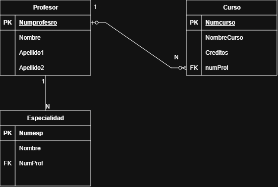

# Diccionario de datos de la base de datos control escolar 

1. Información General

| Elemento | Valor |
| :--- | :--- |
| Proyecto  | Sistema de Control Escolar Universidad |
| Descripción | Base de datos para el control escolar universitario |
| Versión | 1.0 |
| Fecha | Junio 2026 |
| Responsable | Ing. Irving Yael Rojas Hurbano, MTI |
| SGBD | SQLServer |

2. Descripción del sistema de base de datos

Una universidad administra profesores y cursos

> De cada profesor se almacena:

- numero de profesor
- nombre
- especialidad 

> De cada curso se almacena:

- numero de curso 
- Nombre del curso
- Creditos

3. Catálogo de Resntrincciones Utilizadas

| Codigo | Significado |
| :--- | :--- |
| PK | Primary Key |
| FK | Foreign Key |
| NN | Not Null |
| UQ | Unique |
| AI | Auto Increment |
| CK | Check |
| DF | Default |
| FK | Foreign Key |

4. Diccionario de Datos

### Tabla: Profesor

**Descripción:** *Almacena la información de los profesores.*

| Campo | Tipo | Longitud | Restricción | Descripción |
| :--- | :--- | :--- | :--- | :--- |
| Numprofesro | INT | - | PK, AI, NN | Identificador único del profesor |
| Nombre | VARCHAR | 50 | NN | Nombre del profesor |
| Apellido1 | VARCHAR | 50 | NN | Primer apellido del profesor |
| Apellido2 | VARCHAR | 50 | NULL | Segundo apellido del profesor |

---

### Tabla: Curso

**Descripción:** *Almacena los cursos impartidos por los profesores.*

| Campo | Tipo | Longitud | Restricción | Descripción |
| :--- | :--- | :--- | :--- | :--- |
| Numcurso | INT | - | PK, AI, NN | Identificador único del curso |
| NombreCurso | VARCHAR | 100 | NN | Nombre del curso |
| Creditos | INT | 2 | NN | Créditos asignados al curso |
| numProf | INT | - | FK, NN | Profesor que imparte el curso |

---

### Tabla: Especialidad

**Descripción:** *Almacena las especialidades asociadas a cada profesor.*

| Campo | Tipo | Longitud | Restricción | Descripción |
| :--- | :--- | :--- | :--- | :--- |
| Numesp | INT | - | PK, AI, NN | Identificador único de la especialidad |
| Nombre | VARCHAR | 100 | NN | Nombre de la especialidad |
| NumProf | INT | - | FK, NN | Profesor asociado a la especialidad |

---

## 5. Relaciones entre Tablas

| Relación | Cardinalidad | Descripción |
| :--- | :---: | :--- |
| Profesor → Curso | 1:N | Un profesor puede impartir muchos cursos |
| Profesor → Especialidad | 1:N | Un profesor puede tener varias especialidades |

---

## 6. Matriz de Claves Foráneas

| Tabla | Campo FK | Referencia |
| :--- | :--- | :--- |
| Curso | numProf | Profesor (Numprofesro) |
| Especialidad | NumProf | Profesor (Numprofesro) |

---

7. Integridad Referencial  

| Regla | Descripción |
| :--- | :--- |
| IR-01 | No se puede registrar un curso con un profesor inexistente |
| IR-02 | No se puede registrar una especialidad para un profesor inexistente |

8. Reglas del Negocio 

| Codigo | Regla |
| :--- | :--- |
| RN-01 | Un profesor puede impartir varios cursos |
| RN-02 | Un curso solo puede ser impartido por un profesor |
| RN-03 | Puede existir un profesor que actualmente no imparta cursos |
| RN-04 | Todo curso debe estar asignado a un profesor |

9. Diagrama Relacional

### Solución ejercicio Relacional

