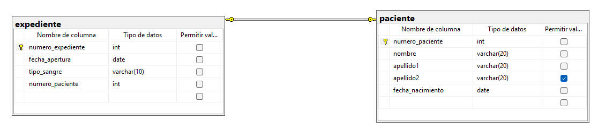

```
CREATE DATABASE hospital;
GO

USE hospital;
GO

CREATE TABLE paciente(
	numero_paciente INT NOT NULL IDENTITY(1,1),
	nombre VARCHAR(20) NOT NULL,
	apellido1 VARCHAR(20) NOT NULL,
	apellido2 VARCHAR(20),
	fecha_nacimiento DATE NOT NULL,

	CONSTRAINT pk_paciente
	PRIMARY KEY (numero_paciente),

	CONSTRAINT uq_numero_paciente
	UNIQUE (numero_paciente)
);
GO

CREATE TABLE expediente (
	numero_expediente INT NOT NULL IDENTITY(1,1),
	fecha_apertura DATE NOT NULL,
	tipo_sangre VARCHAR (10) NOT NULL,
	numero_paciente INT NOT NULL,

	CONSTRAINT pk_expediente
	PRIMARY KEY (numero_expediente),

	CONSTRAINT uq_expediente_paciente
    UNIQUE (numero_paciente),

	CONSTRAINT fk_expediente_paciente
	FOREIGN KEY (numero_paciente)
	REFERENCES paciente (numero_paciente)
);
GO

INSERT INTO paciente 
VALUES ('Yael', 'Rojas', 'Hurbano', '2007-01-05');

INSERT INTO paciente 
VALUES ('Jose', 'X-men', 'Perez', '2007-10-05');

INSERT INTO paciente 
VALUES ('Gerardo', 'Sayayin', NULL, '2006-05-05');

GO

INSERT INTO expediente
VALUES ('2025-02-26','+O',1);

INSERT INTO expediente
VALUES ('2026-05-05','-AB',2);

INSERT INTO expediente
VALUES ('2020-12-24','+B',3);

GO

SELECT * FROM paciente;

SELECT * FROM expediente;
```

## Diagrama

