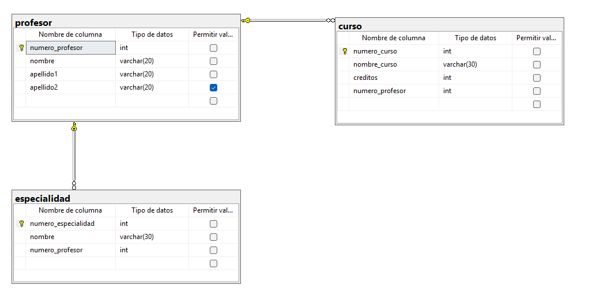

```
CREATE DATABASE profesor_curso;
GO

USE profesor_curso;
GO

CREATE TABLE profesor(
	numero_profesor INT NOT NULL IDENTITY (1,1),
	nombre VARCHAR (20) NOT NULL,
	apellido1 VARCHAR (20) NOT NULL,
	apellido2 VARCHAR (20) NULL,

	CONSTRAINT pk_profesor
	PRIMARY KEY (numero_profesor),
);
GO

CREATE TABLE especialidad(
	numero_especialidad INT NOT NULL IDENTITY (1,1),
	nombre VARCHAR(30) NOT NULL,
	numero_profesor INT NOT NULL,

	CONSTRAINT pk_especialidad 
	PRIMARY KEY (numero_especialidad),

	CONSTRAINT fk_especialidad_profesor
	FOREIGN KEY (numero_profesor)
	REFERENCES profesor(numero_profesor)
);
GO

CREATE TABLE curso(
	numero_curso INT NOT NULL IDENTITY (1,1),
	nombre_curso VARCHAR(30) NOT NULL,
	creditos INT NOT NULL,
	numero_profesor INT NOT NULL,

	CONSTRAINT pk_curso
	PRIMARY KEY (numero_curso),

	CONSTRAINT fk_curso_profesor
	FOREIGN KEY (numero_profesor)
	REFERENCES profesor(numero_profesor)
);
GO

INSERT INTO profesor (nombre, apellido1, apellido2)
VALUES
('Juan', 'Pérez', 'López'),
('María', 'Gómez', 'Ramírez'),
('Carlos', 'Hernández', 'Soto'),
('Ana', 'Morales', NULL);

INSERT INTO especialidad (nombre, numero_profesor)
VALUES
('Matemáticas', 1),
('Programación', 1),
('Física', 2),
('Química', 3);

INSERT INTO curso (nombre_curso, creditos, numero_profesor)
VALUES
('Bases de Datos', 4, 1),
('Programación I', 5, 1),
('Álgebra', 4, 2),
('Química General', 3, 3);
GO

SELECT * FROM profesor;

SELECT * FROM especialidad;

SELECT * FROM curso;
```

## Diagrama



## Diagrama Relacional

