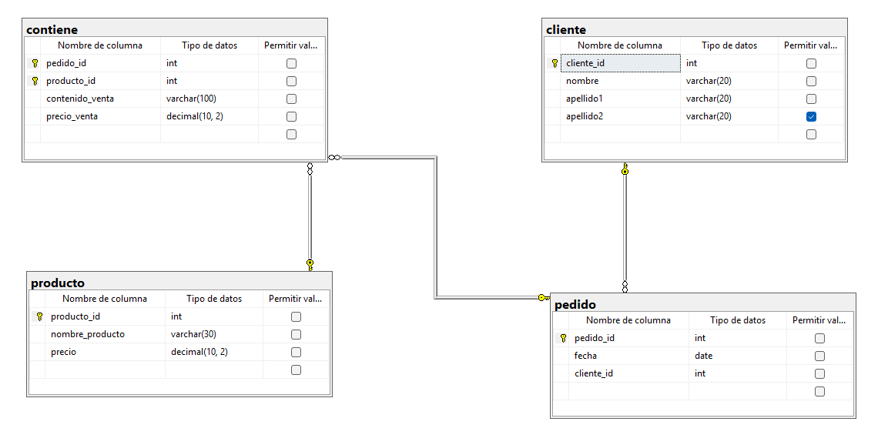

```
CREATE DATABASE pedidos;
GO

USE pedidos;
GO

CREATE TABLE cliente (
	cliente_id INT NOT NULL IDENTITY (1,1),
	nombre VARCHAR (20) NOT NULL,
	apellido1 VARCHAR (20) NOT NULL,
	apellido2 VARCHAR (20) NULL,

	CONSTRAINT pk_cliente
	PRIMARY KEY (cliente_id)
);
GO

CREATE TABLE pedido (
	pedido_id INT NOT NULL IDENTITY (1,1),
	fecha DATE NOT NULL,
	cliente_id INT NOT NULL,

	CONSTRAINT pk_pedido
	PRIMARY KEY (pedido_id),

	CONSTRAINT fk_cliente_pedido
	FOREIGN KEY (cliente_id) 
	REFERENCES cliente(cliente_id)
);
GO

CREATE TABLE producto (
	producto_id INT NOT NULL IDENTITY (1,1),
	nombre_producto VARCHAR (30) NOT NULL,
	precio DECIMAL (10,2) NOT NULL,
	
	CONSTRAINT pk_producto
	PRIMARY KEY (producto_id)
);
GO

CREATE TABLE contiene (
	pedido_id INT NOT NULL,
	producto_id INT NOT NULL,
	contenido_venta VARCHAR (100) NOT NULL,
	precio_venta DECIMAL (10,2) NOT NULL,

	CONSTRAINT pk_contiene
	PRIMARY KEY (pedido_id, producto_id),

	CONSTRAINT fk_contiene_pedido
	FOREIGN KEY (pedido_id)
	REFERENCES pedido(pedido_id),

	CONSTRAINT fk_contiene_producto
	FOREIGN KEY (producto_id)
	REFERENCES producto(producto_id),

	CONSTRAINT ck_contiene_precio_venta
	CHECK (precio_venta > 0.0)
);
GO

INSERT INTO cliente (nombre, apellido1, apellido2)
VALUES
('Juan', 'Pérez', 'López'),
('María', 'Gómez', 'Ramírez'),
('Carlos', 'Hernández', NULL);
GO

INSERT INTO producto (nombre_producto, precio)
VALUES
('Laptop', 15000.00),
('Mouse', 250.00),
('Teclado', 600.00);
GO

INSERT INTO pedido (fecha, cliente_id)
VALUES
('2025-10-10', 1),
('2025-10-11', 2),
('2025-10-12', 1);
GO

INSERT INTO contiene (pedido_id, producto_id, contenido_venta, precio_venta)
VALUES
(1, 1, 'Laptop Lenovo IdeaPad', 15000.00),
(1, 2, 'Mouse inalámbrico Logitech', 250.00),
(2, 3, 'Teclado mecánico RGB', 600.00),
(3, 1, 'Laptop Lenovo IdeaPad', 15000.00),
(3, 3, 'Teclado mecánico RGB', 600.00);
GO

SELECT * FROM cliente;
SELECT * FROM producto;
SELECT * FROM pedido;
SELECT * FROM contiene;
```

## Diagrama




## Diagrama Relacional

