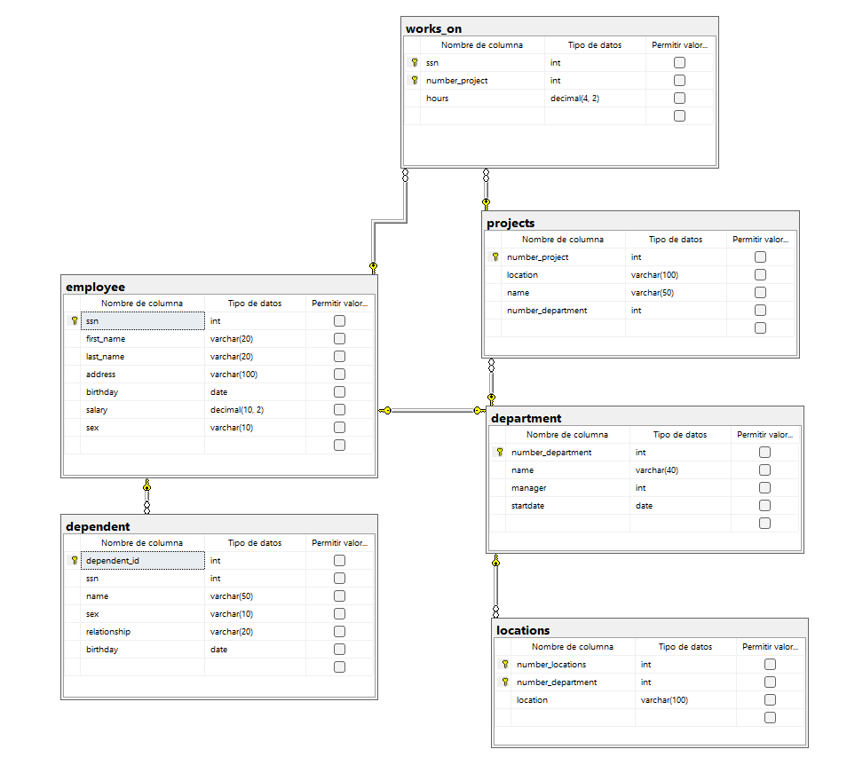

```
CREATE DATABASE trabajo;
GO

USE trabajo;
GO

CREATE TABLE employee (
	ssn INT NOT NULL IDENTITY (1,1),
	first_name VARCHAR (20) NOT NULL,
	last_name VARCHAR (20) NOT NULL,
	address VARCHAR (100) NOT NULL,
	birthday DATE NOT NULL,
	salary DECIMAL (10,2) NOT NULL,
	sex VARCHAR (10) NOT NULL,

	CONSTRAINT pk_employee
	PRIMARY KEY (ssn) 
);
GO

CREATE TABLE dependent (
	dependent_id INT NOT NULL IDENTITY (1,1),
	ssn INT NOT NULL,
	name VARCHAR (50) NOT NULL,
	sex VARCHAR (10) NOT NULL,
	relationship VARCHAR (20) NOT NULL,
	birthday DATE NOT NULL,

	CONSTRAINT pk_dependent
	PRIMARY KEY (dependent_id),

	CONSTRAINT fk_dependent_employee
	FOREIGN KEY (ssn)
	REFERENCES employee(ssn)
);
GO

CREATE TABLE department(
    number_department INT NOT NULL IDENTITY (1,1),
    name VARCHAR(40) NOT NULL,
    manager INT NOT NULL,
    startdate DATE NOT NULL,

    CONSTRAINT pk_department
    PRIMARY KEY(number_department),

    CONSTRAINT uq_manager
    UNIQUE(manager),

	CONSTRAINT fk_department_manager
	FOREIGN KEY (manager)
	REFERENCES employee(ssn)
);
GO

CREATE TABLE locations (
	number_locations INT NOT NULL IDENTITY (1,1),
	number_department INT NOT NULL,
	location VARCHAR (100) NOT NULL,

	CONSTRAINT pk_locations
	PRIMARY KEY (number_locations,number_department),

	CONSTRAINT fk_locations_deparment
	FOREIGN KEY (number_department)
	REFERENCES department(number_department)
);
GO

CREATE TABLE projects (
	number_project INT NOT NULL IDENTITY (1,1),
	location VARCHAR (100) NOT NULL,
	name VARCHAR (50) NOT NULL,
	number_department INT NOT NULL,

	CONSTRAINT pk_projects 
	PRIMARY KEY (number_project),

	CONSTRAINT fk_projects_deparment
	FOREIGN KEY (number_department)
	REFERENCES department(number_department)
);
GO

CREATE TABLE works_on (
	ssn INT NOT NULL,
	number_project INT NOT NULL,
	hours DECIMAL (4,2) NOT NULL,

	CONSTRAINT pk_works_on
	PRIMARY KEY (ssn, number_project),

	CONSTRAINT fk_workson_employee
	FOREIGN KEY (ssn)
	REFERENCES employee(ssn),

	CONSTRAINT fk_workson_projects
	FOREIGN KEY (number_project)
	REFERENCES projects(number_project),
);
GO

INSERT INTO employee (first_name, last_name, address, birthday, salary, sex)
VALUES
('Juan', 'Pérez', 'Monterrey', '1985-05-10', 35000.00, 'M'),
('María', 'Gómez', 'Guadalajara', '1990-08-22', 32000.00, 'F'),
('Carlos', 'López', 'Ciudad de México', '1988-11-15', 28000.00, 'M');
GO

INSERT INTO department (name, manager, startdate)
VALUES
('Sistemas', 1, '2024-01-15'),
('Ventas', 2, '2024-02-01'),
('Recursos Humanos', 3, '2024-03-10');
GO

INSERT INTO locations (number_department, location)
VALUES
(1, 'Monterrey'),
(2, 'Guadalajara'),
(3, 'Ciudad de México');
GO

INSERT INTO projects (location, name, number_department)
VALUES
('Monterrey', 'Sistema Escolar', 1),
('Guadalajara', 'Sistema de Ventas', 2),
('Ciudad de México', 'Portal RH', 3);
GO

INSERT INTO dependent (ssn, name, sex, relationship, birthday)
VALUES
(1, 'Luis Pérez', 'M', 'Hijo', '2015-06-10'),
(2, 'Ana Gómez', 'F', 'Hija', '2017-09-21'),
(3, 'Laura López', 'F', 'Esposa', '1992-04-12');
GO

INSERT INTO works_on (ssn, number_project, hours)
VALUES
(1, 1, 40),
(1, 2, 10),
(2, 2, 35),
(3, 3, 30),
(2, 1, 15);
GO

SELECT * FROM employee;
SELECT * FROM department;
SELECT * FROM locations;
SELECT * FROM projects;
SELECT * FROM dependent;
SELECT * FROM works_on;
```

## Diagrama



## Diagrama Relacional

