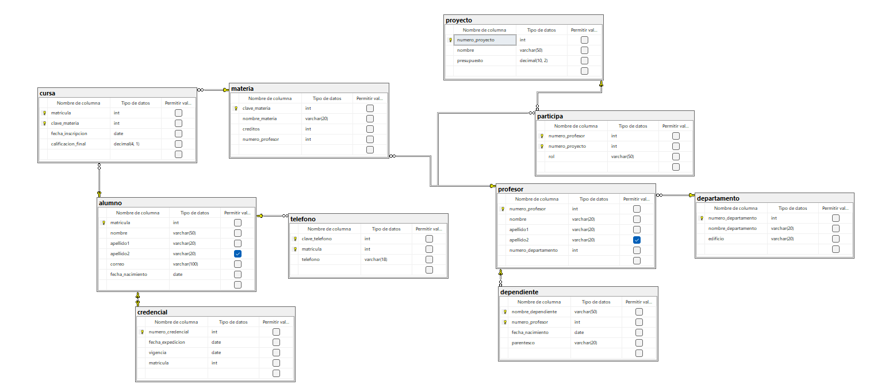

```
CREATE DATABASE escuela;
GO

USE escuela;
GO

CREATE TABLE alumno (
	matricula INT NOT NULL IDENTITY (1,1),
	nombre VARCHAR (50) NOT NULL,
	apellido1 VARCHAR (20) NOT NULL,
	apellido2 VARCHAR (20) NULL,
	correo VARCHAR (100) NOT NULL,
	fecha_nacimiento DATE NOT NULL,

	CONSTRAINT pk_alumno
	PRIMARY KEY (matricula)
);
GO

CREATE TABLE telefono (
	clave_telefono INT NOT NULL IDENTITY (1,1),
	matricula INT NOT NULL,
	telefono VARCHAR (18) NOT NULL,
	
	CONSTRAINT pk_telefono
	PRIMARY KEY (clave_telefono, matricula),

	CONSTRAINT fk_telefono_alumno
	FOREIGN KEY (matricula)
	REFERENCES alumno(matricula)
);
GO

CREATE TABLE credencial (
	numero_credencial INT NOT NULL IDENTITY (1,1),
	fecha_expedicion DATE NOT NULL,
	vigencia DATE NOT NULL,
	matricula INT NOT NULL,

	CONSTRAINT pk_credencial
	PRIMARY KEY (numero_credencial),

	CONSTRAINT fk_credencial_alumno
	FOREIGN KEY (matricula)
	REFERENCES alumno (matricula),

	CONSTRAINT uq_matricula
	UNIQUE (matricula)
);
GO

CREATE TABLE materia (
	clave_materia INT NOT NULL IDENTITY (1,1),
	nombre_materia VARCHAR (20) NOT NULL,
	creditos INT NOT NULL,
	numero_profesor INT NOT NULL,

	CONSTRAINT pk_materia
	PRIMARY KEY (clave_materia)
);
GO

CREATE TABLE cursa (
	matricula INT NOT NULL,
	clave_materia INT NOT NULL,
	fecha_inscripcion DATE NOT NULL,
	calificacion_final DECIMAL (4,1) NOT NULL,

	CONSTRAINT pk_cursa
	PRIMARY KEY (matricula, clave_materia),

	CONSTRAINT fk_cursa_alumno
	FOREIGN KEY (matricula)
	REFERENCES alumno (matricula),
	
	CONSTRAINT fk_cursa_materia
	FOREIGN KEY (clave_materia)
	REFERENCES materia (clave_materia),

	CONSTRAINT ck_cursa_calificacion_final
	CHECK (calificacion_final > 0.0)
);
GO

CREATE TABLE departamento (
	numero_departamento INT NOT NULL IDENTITY (1,1),
	nombre_departamento VARCHAR (20) NOT NULL,
	edificio VARCHAR (20) NOT NULL,

	CONSTRAINT pk_departamento
	PRIMARY KEY (numero_departamento)
);
GO

CREATE TABLE profesor (
	numero_profesor INT NOT NULL IDENTITY (1,1),
	nombre VARCHAR (20) NOT NULL,
	apellido1 VARCHAR (20) NOT NULL,
	apellido2 VARCHAR (20) NULL,
	numero_departamento INT NOT NULL,

	CONSTRAINT pk_profesor
	PRIMARY KEY (numero_profesor),

	CONSTRAINT fk_profesor_departmento
	FOREIGN KEY (numero_departamento)
	REFERENCES departamento (numero_departamento)
);
GO

CREATE TABLE dependiente(
    nombre_dependiente VARCHAR(50) NOT NULL,
    numero_profesor INT NOT NULL,
    fecha_nacimiento DATE NOT NULL,
    parentesco VARCHAR(20) NOT NULL,

    CONSTRAINT pk_dependiente
    PRIMARY KEY(nombre_dependiente, numero_profesor),

    CONSTRAINT fk_dependiente_profesor
    FOREIGN KEY(numero_profesor)
    REFERENCES profesor(numero_profesor)
);
GO

ALTER TABLE materia
ADD CONSTRAINT fk_materia_profesor
FOREIGN KEY (numero_profesor)
REFERENCES profesor (numero_profesor);
GO

CREATE TABLE proyecto (
	numero_proyecto INT NOT NULL IDENTITY (1,1),
	nombre VARCHAR (50) NOT NULL,
	presupuesto DECIMAL (10,2) NOT NULL,

	CONSTRAINT pk_proyecto
	PRIMARY KEY (numero_proyecto)
);
GO

CREATE TABLE participa (
	numero_profesor INT NOT NULL,
	numero_proyecto INT NOT NULL,
	rol VARCHAR (50) NOT NULL,

	CONSTRAINT pk_participa
	PRIMARY KEY (numero_proyecto, numero_profesor),

	CONSTRAINT fk_participa_profesor
	FOREIGN KEY (numero_profesor)
	REFERENCES profesor (numero_profesor),
	
	CONSTRAINT fk_participa_proyecto
	FOREIGN KEY (numero_proyecto)
	REFERENCES proyecto (numero_proyecto)
);
GO

INSERT INTO departamento (nombre_departamento, edificio)
VALUES
('Sistemas', 'Edificio A'),
('Matemáticas', 'Edificio B'),
('Administración', 'Edificio C');
GO

INSERT INTO profesor (nombre, apellido1, apellido2, numero_departamento)
VALUES
('Juan', 'Pérez', 'López', 1),
('María', 'Gómez', 'Ramírez', 2),
('Carlos', 'Hernández', NULL, 3);
GO

INSERT INTO alumno (nombre, apellido1, apellido2, correo, fecha_nacimiento)
VALUES
('Ana', 'Martínez', 'Ruiz', 'ana@escuela.com', '2003-04-15'),
('Luis', 'Torres', 'Sánchez', 'luis@escuela.com', '2002-09-21'),
('Sofía', 'Morales', 'Díaz', 'sofia@escuela.com', '2004-01-30');
GO

INSERT INTO materia (nombre_materia, creditos, numero_profesor)
VALUES
('Bases de Datos', 5, 1),
('Cálculo', 4, 2),
('Programación', 6, 1);
GO

INSERT INTO proyecto (nombre, presupuesto)
VALUES
('Sistema Escolar', 50000.00),
('App Académica', 35000.00),
('Portal Web', 45000.00);
GO

INSERT INTO telefono (matricula, telefono)
VALUES
(1, '8112345678'),
(1, '8187654321'),
(2, '3311122233'),
(3, '5512345678');
GO

INSERT INTO credencial (fecha_expedicion, vigencia, matricula)
VALUES
('2025-01-15', '2026-01-15', 1),
('2025-01-15', '2026-01-15', 2),
('2025-01-15', '2026-01-15', 3);
GO

INSERT INTO dependiente (nombre_dependiente, numero_profesor, fecha_nacimiento, parentesco)
VALUES
('Luis Pérez', 1, '2015-06-12', 'Hijo'),
('Ana Gómez', 2, '2017-09-20', 'Hija'),
('Laura Hernández', 3, '1995-03-18', 'Esposa');
GO

INSERT INTO participa (numero_profesor, numero_proyecto, rol)
VALUES
(1, 1, 'Líder del proyecto'),
(1, 2, 'Desarrollador'),
(2, 2, 'Investigador'),
(3, 3, 'Coordinador');
GO

SELECT * FROM departamento;
SELECT * FROM profesor;
SELECT * FROM alumno;
SELECT * FROM materia;
SELECT * FROM proyecto;
SELECT * FROM telefono;
SELECT * FROM credencial;
SELECT * FROM dependiente;
SELECT * FROM cursa;
SELECT * FROM participa;
```


## Diagrama



## Diagrama Relacional

