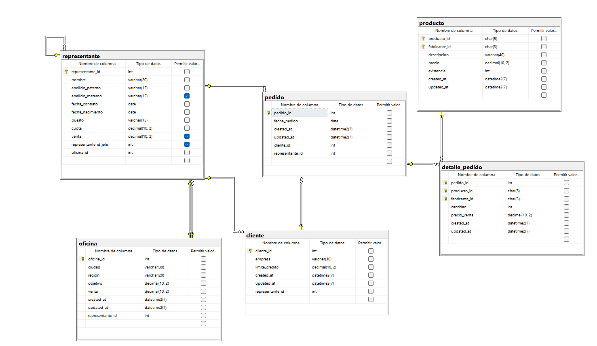
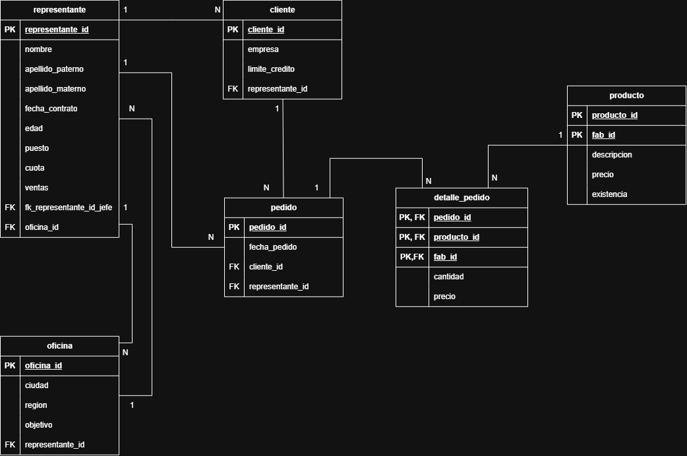

```
-- Crear Database 

CREATE DATABASE comercializadora;
GO

-- Utilizar la base de datos

USE comercializadora;
GO

/*========== CREAR TABLA PRODUCTO ==========*/

CREATE TABLE producto(
	producto_id CHAR (5) NOT NULL,
	fabricante_id CHAR (3) NOT NULL,
	descripcion VARCHAR (40) NOT NULL,
	precio DECIMAL (10,2) NOT NULL,
	existencia INT NOT NULL,

	CONSTRAINT pk_producto
	PRIMARY KEY (producto_id, fabricante_id),

	CONSTRAINT uq_producto_descripcion
	UNIQUE (descripcion),
	
	CONSTRAINT ck_producto_precio
	CHECK (precio > 0.0),
	
	CONSTRAINT ck_producto_existencia 
	CHECK (existencia BETWEEN 1 AND 100) 
);
GO


/*========== CREAR TABLA REPRESENTANTE ==========*/

CREATE TABLE representante (
	representante_id INT NOT NULL IDENTITY (1,1)
	CONSTRAINT pk_representante 
	PRIMARY KEY,

	nombre VARCHAR (20) NOT NULL,
	apellido_paterno VARCHAR (15) NOT NULL,
	apellido_materno VARCHAR (15) NULL,
	fecha_contrato DATE NOT NULL,
	fecha_nacimiento DATE NOT NULL,
	puesto VARCHAR (15) NOT NULL,

	cuota DECIMAL (10,2) NOT NULL
	CONSTRAINT ck_representante_cuota
	CHECK (cuota > 0.0),

	venta DECIMAL (10,2) NULL
	CONSTRAINT ck_representante_venta
	CHECK (venta > 0.0),

	representante_id_jefe INT -- Foreign Key recursiva o jerarquica 
	CONSTRAINT fk_representante_representante
	FOREIGN KEY (representante_id_jefe)
	REFERENCES representante (representante_id),
	
	oficina_id INT NOT NULL, -- Foreign key de oficina 

	created_at DATETIME2 NOT NULL
	CONSTRAINT df_representante_created_at
	DEFAULT SYSDATETIME (),

	updated_at DATETIME2 NOT NULL
	CONSTRAINT df_representante_updated_at
	DEFAULT SYSDATETIME()
);
GO

/*========== CREAR TABLA OFICINA ==========*/

CREATE TABLE oficina (
	oficina_id INT NOT NULL,
	ciudad VARCHAR (30) NOT NULL,
	region VARCHAR (20) NOT NULL,
	objetivo DECIMAL (10,2) NOT NULL,
	venta DECIMAL (10,2) NOT NULL,

	created_at DATETIME2 NOT NULL
	CONSTRAINT df_oficina_created_at
	DEFAULT SYSDATETIME (),

	updated_at DATETIME2 NOT NULL
	CONSTRAINT df_oficina_updated_at
	DEFAULT SYSDATETIME(),

	representante_id INT NOT NULL, -- Foreign key de representantes

	CONSTRAINT pk_oficina
	PRIMARY KEY (oficina_id),
	
	CONSTRAINT uq_oficina_ciudad
	UNIQUE (ciudad),

	CONSTRAINT ck_oficina_region
	CHECK (region IN ('Este','Oeste')),

	CONSTRAINT ck_oficina_objetivo
	CHECK (objetivo > 0.0),

	CONSTRAINT ck_oficina_venta
	CHECK (venta > 0.0),

	CONSTRAINT fk_oficina_representante 
	FOREIGN KEY (oficina_id)
	REFERENCES representante(representante_id)
);
GO

/*========== AGREGAR LOS CAMPOS DE AUDITORIA A PPRODUCTOS ==========*/

ALTER TABLE producto
ADD 
created_at DATETIME2 NOT NULL,
updated_at DATETIME2 NOT NULL;
GO

ALTER TABLE producto
ADD CONSTRAINT df_producto_created_at
DEFAULT SYSDATETIME () FOR created_at;

ALTER TABLE producto
ADD CONSTRAINT df_producto_updated_at
DEFAULT SYSDATETIME () FOR updated_at;

/*========== AGREGAR LA FOREIFGN KEY A REPRESENTANTE A OFICINA ==========*/

ALTER TABLE representante
ADD CONSTRAINT fk_representante_oficina
FOREIGN KEY (oficina_id)
REFERENCES oficina (oficina_id)

/*========== CREAR LA TABLA CLIENTE ==========*/

CREATE TABLE cliente (
	cliente_id INT NOT NULL IDENTITY (1,1)
	CONSTRAINT pk_cliente
	PRIMARY KEY,

	empresa VARCHAR (30) NOT NULL
	CONSTRAINT uq_cliente_empresa
	UNIQUE,

	limite_credito DECIMAL (10,2) NOT NULL
	CONSTRAINT ck_cliente_limite_credito
	CHECK (limite_credito BETWEEN 1000 AND 100000),

	created_at DATETIME2 NOT NULL
	CONSTRAINT df_cliente_created_at 
	DEFAULT SYSDATETIME (),

	updated_at DATETIME2 NOT NULL
	CONSTRAINT df_cliente_updated_at
	DEFAULT SYSDATETIME (),

	representante_id INT NOT NULL -- Foreign Key de representante
	CONSTRAINT fk_cliente_representante
	FOREIGN KEY (representante_id)
	REFERENCES representante (representante_id)
);
GO

/*========== CREAR LA TABLA PEDIDO ==========*/

CREATE TABLE pedido (
	pedido_id INT NOT NULL IDENTITY (1,1)
	CONSTRAINT pk_pedido
	PRIMARY KEY,

	fecha_pedido DATE NOT NULL
	CONSTRAINT df_pedido_fecha_pedido
	DEFAULT GETDATE (),

	created_at DATETIME2 NOT NULL
	CONSTRAINT df_pedido_created_at
	DEFAULT SYSDATETIME (),

	updated_at DATETIME2 NOT NULL
	CONSTRAINT df_pedido_updated_at
	DEFAULT SYSDATETIME (),

	cliente_id INT NOT NULL,
	CONSTRAINT fk_pedido_cliente
	FOREIGN KEY (cliente_id)
	REFERENCES cliente (cliente_id),

	representante_id INT NOT NULL
	CONSTRAINT fk_pedido_representante
	FOREIGN KEY (representante_id)
	REFERENCES representante (representante_id)
);
GO

/*========== CREAR LA TABLA DETALLE PEDIDO ==========*/

CREATE TABLE detalle_pedido (
	pedido_id INT NOT NULL,
	producto_id CHAR (5) NOT NULL,
	fabricante_id CHAR (3) NOT NULL,

	cantidad INT NOT NULL
	CONSTRAINT ck_detalle_pedido_cantidad
	CHECK (cantidad > 0.0),

	precio_venta DECIMAL (10,2) NOT NULL
	CONSTRAINT ck_detalle_pedido_precio_venta
	CHECK (precio_venta > 0.0),

	created_at DATETIME2 NOT NULL
	CONSTRAINT df_detalle_pedido_created_at
	DEFAULT SYSDATETIME (),

	updated_at DATETIME2 NOT NULL
	CONSTRAINT df_detalle_pedido_updated_at
	DEFAULT SYSDATETIME (),

	CONSTRAINT pk_detalle_venta
	PRIMARY KEY (pedido_id, producto_id, fabricante_id),

	CONSTRAINT dk_detalle_pedido_pedido
	FOREIGN KEY (pedido_id)
	REFERENCES pedido (pedido_id),

	CONSTRAINT dk_detalle_pedido_producto
	FOREIGN KEY (producto_id, fabricante_id)
	REFERENCES producto (producto_id, fabricante_id),
);
```

## Diagrama



## Diagrama Relacional

