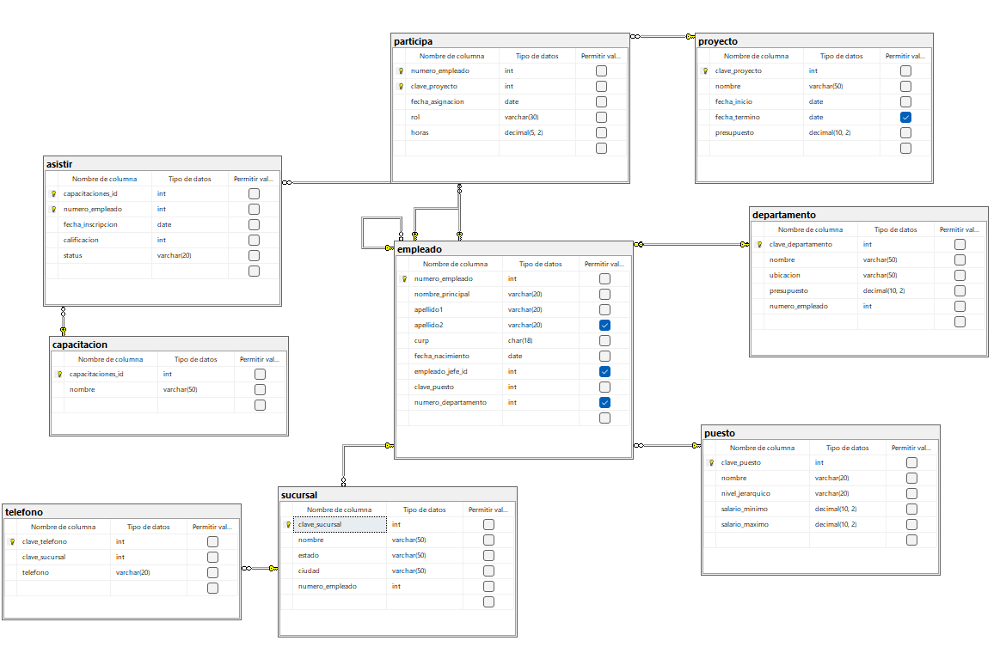

```
CREATE DATABASE empresa;

USE empresa;

CREATE TABLE empleado (
	numero_empleado INT NOT NULL IDENTITY (1,1),
	nombre_principal VARCHAR (20) NOT NULL,
	apellido1 VARCHAR (20) NOT NULL,
	apellido2 VARCHAR (20) NULL,
	curp CHAR (18) NOT NULL,
	fecha_nacimiento DATE NOT NULL,

	CONSTRAINT pk_empleado
	PRIMARY KEY (numero_empleado),

	empleado_jefe_id INT NULL,

	CONSTRAINT fk_empleado_empleado
	FOREIGN KEY (empleado_jefe_id)
	REFERENCES empleado(numero_empleado)
);

CREATE TABLE puesto (
	clave_puesto INT NOT NULL IDENTITY (1,1),
	nombre VARCHAR (20) NOT NULL,
	nivel_jerarquico VARCHAR (20) NOT NULL,
	salario_minimo DECIMAL (10,2) NOT NULL,
	salario_maximo DECIMAL (10,2) NOT NULL,
	
	CONSTRAINT pk_puesto 
	PRIMARY KEY (clave_puesto)
);

ALTER TABLE empleado 
ADD clave_puesto INT NOT NULL,
CONSTRAINT fk_empleado_puesto
FOREIGN KEY (clave_puesto)
REFERENCES puesto(clave_puesto);

CREATE TABLE departamento (
	clave_departamento INT NOT NULL IDENTITY (1,1),
	nombre VARCHAR (50) NOT NULL,
	ubicacion VARCHAR (50) NOT NULL,
	presupuesto DECIMAL (10,2) NOT NULL,
	numero_empleado INT NOT NULL,

	CONSTRAINT pk_departamento
	PRIMARY KEY(clave_departamento),

	CONSTRAINT fk_departamento_administra
	FOREIGN KEY (numero_empleado)
	REFERENCES empleado(numero_empleado),

	CONSTRAINT ck_departamento_presupuesto
	CHECK (presupuesto > 0.0)
);

ALTER TABLE empleado
ADD numero_departamento INT NULL,
CONSTRAINT fk_empleado_departamento
FOREIGN KEY (numero_departamento)    
REFERENCES departamento(clave_departamento);

CREATE TABLE capacitacion (
	capacitaciones_id INT NOT NULL IDENTITY (1,1),
	nombre VARCHAR(50) NOT NULL,

	CONSTRAINT pk_capacitacion
	PRIMARY KEY (capacitaciones_id)
);

CREATE TABLE asistir (
	capacitaciones_id INT NOT NULL,
	numero_empleado INT NOT NULL,
	fecha_inscripcion DATE NOT NULL,
	calificacion INT NOT NULL,
	status VARCHAR (20) NOT NULL,

	CONSTRAINT pk_asistir
	PRIMARY KEY (capacitaciones_id, numero_empleado),

	CONSTRAINT fk_asistir_capacitaciones
	FOREIGN KEY (capacitaciones_id)
	REFERENCES capacitacion(capacitaciones_id),

	CONSTRAINT fk_asistir_empleado
	FOREIGN KEY (numero_empleado)
	REFERENCES empleado(numero_empleado)
);

CREATE TABLE proyecto (
	clave_proyecto INT NOT NULL IDENTITY (1,1),
	nombre VARCHAR (50) NOT NULL,
	fecha_inicio DATE NOT NULL,
	fecha_termino DATE NULL,
	presupuesto DECIMAL (10,2) NOT NULL,

	CONSTRAINT pk_proyecto
	PRIMARY KEY (clave_proyecto),

	CONSTRAINT ck_proyecto_presupuesto
	CHECK (presupuesto > 0.0)
);

CREATE TABLE participa (
    numero_empleado INT NOT NULL,
    clave_proyecto INT NOT NULL,
    fecha_asignacion DATE NOT NULL,
    rol VARCHAR(30) NOT NULL,
    horas DECIMAL(5,2) NOT NULL,

    CONSTRAINT pk_participa
    PRIMARY KEY (numero_empleado, clave_proyecto),

    CONSTRAINT fk_participa_empleado
    FOREIGN KEY (numero_empleado)
    REFERENCES empleado(numero_empleado),

    CONSTRAINT fk_participa_proyecto
    FOREIGN KEY (clave_proyecto)
    REFERENCES proyecto(clave_proyecto)
);

CREATE TABLE sucursal (
	clave_sucursal INT NOT NULL IDENTITY (1,1),
	nombre VARCHAR (50) NOT NULL,
	estado VARCHAR (50) NOT NULL,
	ciudad VARCHAR (50) NOT NULL,
	numero_empleado INT NOT NULL,

	CONSTRAINT pk_sucursal 
	PRIMARY KEY (clave_sucursal),

	CONSTRAINT fk_sucursal_empleado
	FOREIGN KEY (numero_empleado)
	REFERENCES empleado (numero_empleado)
);

CREATE TABLE telefono (
	clave_telefono INT NOT NULL IDENTITY(1,1),
	clave_sucursal INT NOT NULL,
	telefono VARCHAR (20) NOT NULL,

	CONSTRAINT pk_telefono
	PRIMARY KEY (clave_telefono),

	CONSTRAINT fk_telefono_sucursal 
	FOREIGN KEY (clave_sucursal)
	REFERENCES sucursal(clave_sucursal)
);

INSERT INTO puesto (nombre, nivel_jerarquico, salario_minimo, salario_maximo)
VALUES
('Gerente', 'Alto', 40000.00, 70000.00),
('Analista', 'Medio', 20000.00, 35000.00),
('Programador', 'Operativo', 15000.00, 30000.00);
GO

INSERT INTO empleado
(nombre_principal, apellido1, apellido2, curp, fecha_nacimiento, empleado_jefe_id, clave_puesto)
VALUES
('Juan', 'Pérez', 'López', 'PELJ850510HNLXXX01', '1985-05-10', NULL, 1),
('María', 'Gómez', 'Ruiz', 'GORM900822MNLXXX02', '1990-08-22', NULL, 2),
('Carlos', 'Hernández', NULL, 'HEHC920315HNLXXX03', '1992-03-15', NULL, 3);
GO

UPDATE empleado
SET empleado_jefe_id = 1
WHERE numero_empleado IN (2,3);
GO

UPDATE empleado
SET empleado_jefe_id = 1
WHERE numero_empleado IN (2,3);
GO

INSERT INTO departamento
(nombre, ubicacion, presupuesto, numero_empleado)
VALUES
('Sistemas', 'Edificio A', 250000.00, 1),
('Recursos Humanos', 'Edificio B', 120000.00, 2),
('Finanzas', 'Edificio C', 180000.00, 3);
GO

UPDATE empleado
SET numero_departamento = 1
WHERE numero_empleado = 1;
GO

UPDATE empleado
SET numero_departamento = 2
WHERE numero_empleado = 2;
GO

UPDATE empleado
SET numero_departamento = 3
WHERE numero_empleado = 3;
GO

INSERT INTO capacitacion (nombre)
VALUES
('SQL Server'),
('Programación en C#'),
('Liderazgo');
GO

INSERT INTO proyecto
(nombre, fecha_inicio, fecha_termino, presupuesto)
VALUES
('Sistema ERP', '2025-01-15', '2025-12-15', 500000.00),
('Portal Web', '2025-02-01', NULL, 250000.00),
('App Móvil', '2025-03-10', NULL, 300000.00);
GO

INSERT INTO sucursal
(nombre, estado, ciudad, numero_empleado)
VALUES
('Centro', 'Jalisco', 'Guadalajara', 1),
('Norte', 'Nuevo León', 'Monterrey', 2),
('Sur', 'Yucatán', 'Mérida', 3);
GO

INSERT INTO telefono (clave_sucursal, telefono)
VALUES
(2, '8181234567'),
(2, '8187654321'),
(3, '3331234567'),
(4, '5559876543');
GO

INSERT INTO asistir
(capacitaciones_id, numero_empleado, fecha_inscripcion, calificacion, status)
VALUES
(1, 1, '2025-01-10', 95, 'Aprobado'),
(2, 2, '2025-02-05', 90, 'Aprobado'),
(3, 3, '2025-03-12', 88, 'Aprobado'),
(1, 2, '2025-01-10', 85, 'Aprobado');
GO

SELECT * FROM puesto;
SELECT * FROM empleado;
SELECT * FROM departamento;
SELECT * FROM capacitacion;
SELECT * FROM asistir;
SELECT * FROM proyecto;
SELECT * FROM participa;
SELECT * FROM sucursal;
SELECT * FROM telefono
```

## Diagrama

