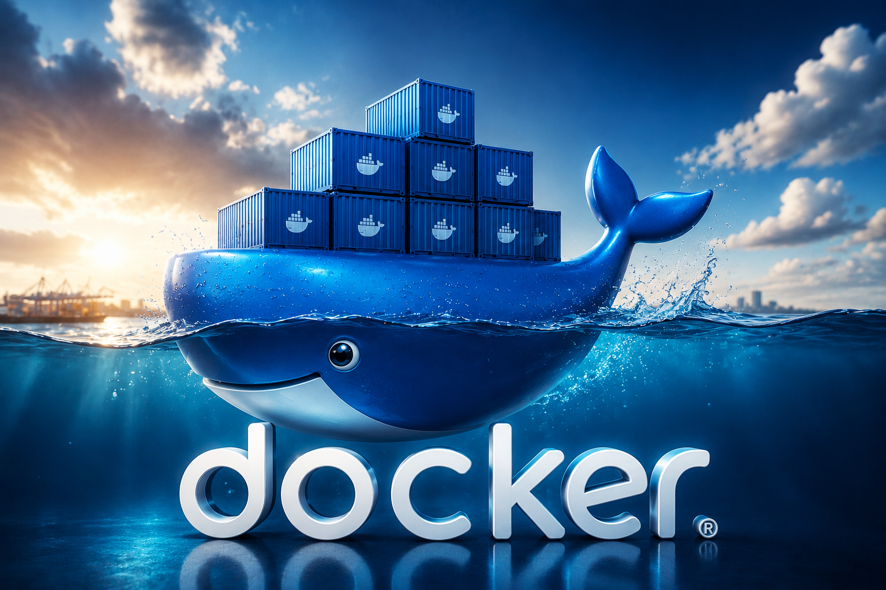

# 📊 Curso de Bases de Datos: De los Fundamentos al Lenguaje SQL

¡Bienvenido al repositorio de la materia de Bases de Datos! Este espacio está diseñado para consolidar todos los conocimientos teóricos y prácticos adquiridos a lo largo del curso, abarcando desde la abstracción conceptual de la información hasta la manipulación e implementación de bases de datos relacionales robustas.

---

## 🗺️ Mapa de Ruta del Aprendizaje (Roadmap)

```
[1. Fundamentos] ──> [2. Modelo E-R] ──> [3. Modelo Relacional] ──> [4. SQL-LDD] ──> [5. SQL-LMD]
```

---

## 📚 Contenido del Curso

### 1. 🔍 Fundamentos de Bases de Datos

Introducción a los conceptos clave para entender cómo y por qué almacenamos datos de forma estructurada.

- Diferencia entre datos e información; evolución de los archivos tradicionales a las Bases de Datos.
- Arquitectura ANSI-SPARC (tres niveles), componentes y objetivos de un SGBD.
- Comprensión de los niveles físico, conceptual y de visión.

---

### 2. 📐 Modelado de Datos: Modelo Entidad-Relación (E-R)

La fase de diseño conceptual donde transformamos requerimientos del mundo real en diagramas estructurados.

- Entidades fuertes/débiles; atributos clave, compuestos, multivalorados y derivados.
- Cardinalidad y participación (1:1, 1:N, N:M).
- Creación de diagramas conceptuales claros para representar la lógica del negocio.

---

### 3. 🔄 El Modelo Relacional

Transición del modelo conceptual (E-R) al modelo lógico apto para sistemas modernos.

- Tablas, tuplas (filas), atributos (columnas) y dominios.
- Identificación de Claves Primarias (PK) y Claves Foráneas (FK).
- Proceso de mapeo de entidades y relaciones hacia tablas físicas.
- Restricciones y acciones en cascada (`ON DELETE` / `ON UPDATE`).

---

### 4. 🔨 Construcción con SQL-LDD (Lenguaje de Definición de Datos)

Implementación física de la estructura de la base de datos utilizando código SQL estándar.

- Sentencias: `CREATE`, `ALTER` y `DROP`.
- Restricciones: `PRIMARY KEY`, `FOREIGN KEY`, `UNIQUE`, `NOT NULL` y `CHECK`.

```sql
-- Ejemplo de creación de tablas (LDD)
CREATE TABLE alumnos (
    alumno_id          INT           PRIMARY KEY,
    matricula          VARCHAR(15)   UNIQUE NOT NULL,
    nombre             VARCHAR(50)   NOT NULL,
    fecha_nacimiento   DATE,
    estado             VARCHAR(10)   DEFAULT 'Activo'
);

CREATE TABLE inscripciones (
    inscripcion_id   INT        PRIMARY KEY,
    alumno_id        INT,
    fecha_registro   TIMESTAMP  DEFAULT CURRENT_TIMESTAMP,
    FOREIGN KEY (alumno_id) REFERENCES alumnos(alumno_id) ON DELETE CASCADE
);
```

---

### 5. ⚡ Manipulación con SQL-LMD (Lenguaje de Manipulación de Datos)

Interacción directa con los datos almacenados para consulta y modificación.

- Sentencias: `INSERT`, `SELECT`, `UPDATE` y `DELETE`.
- Cláusulas: `WHERE`, `ORDER BY`, `GROUP BY` y `HAVING`.
- Combinación de tablas mediante `INNER JOIN`, `LEFT JOIN` y `RIGHT JOIN`.

```sql
-- Ejemplo de consulta multitable (LMD)
SELECT
    a.nombre,
    i.fecha_registro
FROM alumnos a
INNER JOIN inscripciones i ON a.alumno_id = i.alumno_id
WHERE a.estado = 'Activo'
ORDER BY i.fecha_registro DESC;
```

---

## 📂 Estructura del Repositorio

```
├── 📁 01_fundamentos/        # Apuntes teóricos
├── 📁 02_modelo_er/          # Diagramas y casos de estudio
├── 📁 03_modelo_relacional/  # Ejercicios de mapeo
├── 📁 04_sql_ldd/            # Scripts de creación de esquemas (.sql)
├── 📁 05_sql_lmd/            # Scripts de consultas y manipulación (.sql)
└── README.md                 # Presentación del curso
```

---

## 🛠️ Tecnologías Sugeridas

- [Draw.io](https://app.diagrams.net/) / [Lucidchart](https://www.lucidchart.com/)
- MySQL / PostgreSQL / SQL Server
- DBeaver / Azure Data Studio / Workbench

---

## 👤 Autor

- [Irving Yael Rojas Hurbano]
- [25300678@uttt.edu.mx]

---


# Contenedores de Sistemas Gestores de Base de Datos



## Comandos Docker con Descripcion 

| Comando | Descripción |
| :--- | :--- |
| **docker --version** | _Verifica la version de Docker_ |
| **docker pull nombre_imagen** | _Descarga una imagen de Docker Hub_ [DockerHub](https://hun.docker.com/) |
| **docker images** | _Ver las imagenes_ |
| **docker run** | _Crear un contenedor_ |
| **docker ps** | _Visualiza todos los contenedores en ejecución_ |
| **docker container ls** | _Visualiza todos los contenedores en ejecución_ |
| **docker ps -a** | _Visualiza todos los contenedores en ejecución_ |
| **docker container ls -a** | _Visualiza todos los contenedores en ejecución_ |
| **docker stop nombre_contenedor o id** | _Detiene un contenedor_ |
| **docker start nombre_contenedor o id** | _Inicia un contenedor_ |
| **docker rm nombre_contenedor o id** | _Elimina un contenedor que no esta en ejecucion_ |
| **docker rm -f nombre_contenedor o id** | _Elimina un contenedor que esta en ejecucion_ |
| **docker volume ls** | _Lista los cambios que tiene docker_ |
| **docker volume create nombre_volume** | _Crea un volumen_ |
| **docker volume rm nombre_volume** | _Elimina un columen_ |

## Comandos de Contenedores

```
docker pull docker/getting-started
```

### Contenedor de Tutorial de docker

```
docker run -d --name tutorial-docker -p 80:80 docker/getting-started:latest
                                ó
docker run -d --name tutorial-docker -p 80:80 d7933
```

### Contenedor de MariaDB Sin Volumen

```
docker run -d --name server-MariaDBG3 -p 3342:3306 -e MARIADB_ROOT_PASSWORD=12345 d8e9
```

### Contenedor de MariaDB Con Volumen

```
docker run -d --name server-MariaDBG3 \ 
-p 3342:3306 -e MARIADB_ROOT_PASSWORD=12345 \
-v vol-mariadbg3:/var/lib/mysql d8e9
```

### Contenedor Postgres Con Volumen

```
docker run -d --name server-postgresg3 \
-e POSTGRES_PASSWORD=123456 \
-p 5456:5432 -v vol-postgresg3:/var/lib/postgressql/data \
eba8d
```

### Contenedor de SQLServer Con Volumen

```
docker run -e "ACCEPT_EULA=Y" -e "MSSQL_SA_PASSWORD=P@ssw0rd" \
   -u 0 \
   -p 1450:1433 --name SQLServerG3 \
   -d -v vol-sqlserverg3:/var/opt/mssql/data \
   e07b9
```

### Extras

```
-d: -detach
-p: -port
-f: -force

Manage volumes

Commands:
  create      Create a volume
  inspect     Display detailed information on one or more volumes
  ls          List volumes
  prune       Remove unused local volumes
  rm          Remove one or more volumes

Run 'docker volume COMMAND --help' for more information on a command.
```

# Guía Rápida de Comandos Docker

Esta guía contiene los comandos más utilizados divididos por categorías para facilitar la administración de contenedores e imágenes.

---

## 1. Gestión de Contenedores
| Comando | Descripción |
| :--- | :--- |
| `docker run [imagen]` | Crea y arranca un nuevo contenedor |
| `docker run -d [imagen]` | Arranca el contenedor en segundo plano (detached) |
| `docker run -p 8080:80 [imagen]` | Mapea el puerto local 8080 al 80 del contenedor |
| `docker ps` | Lista solo los contenedores en ejecución |
| `docker ps -a` | Lista todos los contenedores (activos e inactivos) |
| `docker stop [id/nombre]` | Detiene un contenedor de forma segura |
| `docker start [id/nombre]` | Inicia un contenedor previamente detenido |
| `docker restart [id/nombre]` | Reinicia un contenedor |
| `docker rm [id/nombre]` | Elimina un contenedor (debe estar detenido) |
| `docker rm -f [id/nombre]` | Fuerza la eliminación de un contenedor activo |

---

## 2. Gestión de Imágenes
| Comando | Descripción |
| :--- | :--- |
| `docker images` | Lista todas las imágenes locales |
| `docker pull [imagen]` | Descarga una imagen desde Docker Hub |
| `docker build -t [nombre] .` | Construye una imagen desde un Dockerfile |
| `docker rmi [id/nombre]` | Elimina una imagen local |
| `docker tag [id] [nuevo_nombre]` | Cambia el nombre o etiqueta de una imagen |

---

## 3. Diagnóstico y Ejecución
| Comando | Descripción |
| :--- | :--- |
| `docker logs [nombre]` | Muestra la salida de consola del contenedor |
| `docker logs -f [nombre]` | Sigue los logs en tiempo real |
| `docker exec -it [nombre] bash` | Entra a la terminal interactiva del contenedor |
| `docker inspect [nombre]` | Muestra información detallada en formato JSON |
| `docker stats` | Estadísticas de uso de CPU, RAM y Red en tiempo real |
| `docker top [nombre]` | Muestra los procesos que corren dentro del contenedor |

---

## 4. Volúmenes y Redes
| Comando | Descripción |
| :--- | :--- |
| `docker volume ls` | Lista todos los volúmenes |
| `docker volume create [nombre]` | Crea un nuevo volumen persistente |
| `docker volume rm [nombre]` | Elimina un volumen específico |
| `docker network ls` | Lista las redes de Docker |
| `docker network create [nombre]` | Crea una red personalizada para conectar contenedores |

---

## 5. Mantenimiento y Limpieza
| Comando | Descripción |
| :--- | :--- |
| `docker system prune` | Elimina contenedores detenidos y redes no usadas |
| `docker system prune -a` | Elimina todo lo anterior más imágenes no utilizadas |
| `docker image prune` | Elimina solo imágenes huérfanas (dangling) |

---

## 6. Docker Compose
| Comando | Descripción |
| :--- | :--- |
| `docker-compose up -d` | Levanta todos los servicios definidos en el .yml |
| `docker-compose down` | Detiene y elimina contenedores, redes y volúmenes |
| `docker-compose ps` | Lista el estado de los servicios del stack |
| `docker-compose logs -f` | Muestra los logs de todos los servicios a la vez |
